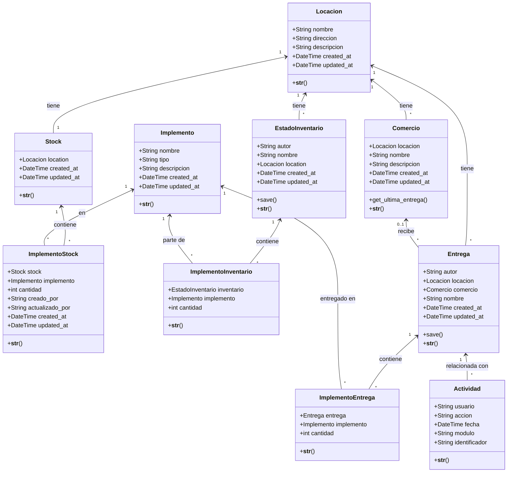

# Diagrama de Clases de Condevuelta

```mermaid
classDiagram
    class Locacion {
        +String nombre
        +String direccion
        +String descripcion
        +DateTime created_at
        +DateTime updated_at
        +__str__()
    }

    class Comercio {
        +Locacion locacion
        +String nombre
        +String descripcion
        +DateTime created_at
        +DateTime updated_at
        +get_ultima_entrega()
        +__str__()
    }

    class Implemento {
        +String nombre
        +String tipo
        +String descripcion
        +DateTime created_at
        +DateTime updated_at
        +__str__()
    }

    class Stock {
        +Locacion location
        +DateTime created_at
        +DateTime updated_at
        +__str__()
    }

    class ImplementoStock {
        +Stock stock
        +Implemento implemento
        +int cantidad
        +String creado_por
        +String actualizado_por
        +DateTime created_at
        +DateTime updated_at
        +__str__()
    }

    class EstadoInventario {
        +String autor
        +String nombre
        +Locacion location
        +DateTime created_at
        +DateTime updated_at
        +save()
        +__str__()
    }

    class ImplementoInventario {
        +EstadoInventario inventario
        +Implemento implemento
        +int cantidad
        +__str__()
    }

    class Entrega {
        +String autor
        +Locacion locacion
        +Comercio comercio
        +String nombre
        +DateTime created_at
        +DateTime updated_at
        +save()
        +__str__()
    }

    class ImplementoEntrega {
        +Entrega entrega
        +Implemento implemento
        +int cantidad
        +__str__()
    }

    class Actividad {
        +String usuario
        +String accion
        +DateTime fecha
        +String modulo
        +String identificador
        +__str__()
    }

    Locacion "1" <-- "*" Comercio : tiene
    Locacion "1" <-- "1" Stock : tiene
    Stock "1" <-- "*" ImplementoStock : contiene
    Implemento "1" <-- "*" ImplementoStock : en
    EstadoInventario "1" <-- "*" ImplementoInventario : contiene
    Locacion "1" <-- "*" EstadoInventario : tiene
    Entrega "1" <-- "*" ImplementoEntrega : contiene
    Locacion "1" <-- "*" Entrega : tiene
    Comercio "0..1" <-- "*" Entrega : recibe
    Entrega "1" <-- "*" Actividad : relacionada con
    Implemento "1" <-- "*" ImplementoInventario : parte de
    Implemento "1" <-- "*" ImplementoEntrega : entregado en
```